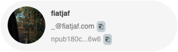
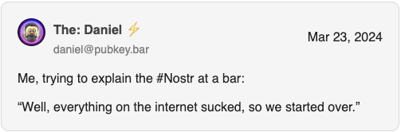
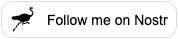
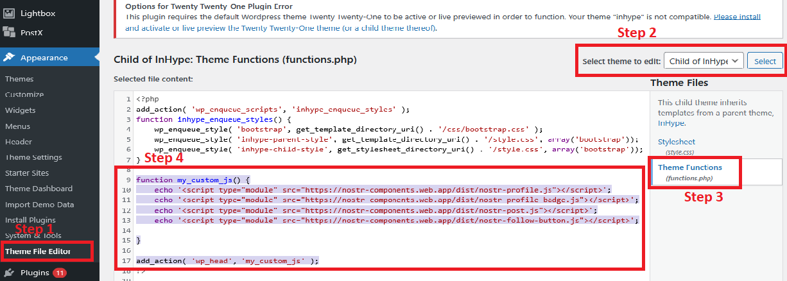
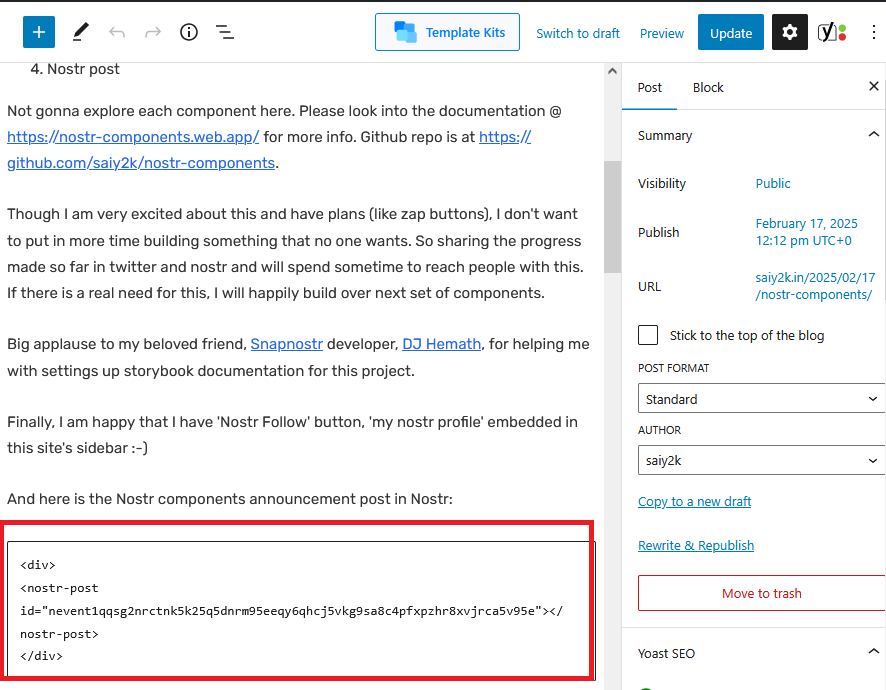

# Nostr Components

**Take Nostr content beyond Nostr clients – embed it anywhere on the internet.**

## 🚀 About the Project

Nostr Components makes it easy to embed **Nostr profiles, posts, and follow buttons** in any website. Inspired by [fiatjaf's Nostr Web Components](https://unpkg.com/nostr-web-components@0.0.6/demo.html). this project **adds a beautiful UI, a storybook component generator (for webmasters),** and expands the usability of Nostr across the web.

## 🏗️ Available Components

🔹 **[Nostr Profile Badge](#1-nostr-profile-badge-)** - Compact badge-style profile display  
🔹 **[Nostr Profile](#2-nostr-profile-)** - Full Nostr profile with more details  
🔹 **[Nostr Post](#3-nostr-post-)** - Embed a specific Nostr post  
🔹 **[Nostr Follow](#4-nostr-follow-)** - Follow button for Nostr  
🔹 **[Wordpress Integration](#5-wordpress-integration)** - Wordpress Integration

### Future roadmap:

🔹 Zap button.  
🔹 Wordpress plugin wrapping all the components - Think you install this WP plugin, configure it with your npub that has a LN-URL. And instantly you get a zap button for all your blog posts.

## 📌 Why Use Nostr Components?

✅ **Simplified Integration** - Nostr Development Kit (NDK) and related Nostr libraries are bundled in. Just include our script!
✅ **Lightweight & Fast** - Works on any modern browser.
✅ **Fully Customizable** - Match your website’s style with ease.
✅ **Decentralized Friendly** - Works seamlessly with any custom set of Nostr relays.

## 🛠️ Usage

1.  **Include the Script(s):** Add the compiled component script to your HTML's `<head>`. If using the `nostr-post` component with multiple images/videos, also include Glide.js CSS for the carousel feature.

    ```html
    <head>
      <!-- Required: Nostr Components Script (choose UMD or ES) -->
      <script src="./dist/nostr-components.umd.js"></script>
      <!-- Or nostr-components.es.js -->
      <script>
        // Initialize components (only needed for UMD build)
        NostrComponents.default.init();
      </script>

      <!-- Optional: Glide.js CSS for Post Carousel -->
      <!-- Needed only if displaying posts that might contain multiple images/videos -->
      <link
        rel="stylesheet"
        href="https://cdn.jsdelivr.net/npm/@glidejs/glide/dist/css/glide.core.min.css"
      />
      <link
        rel="stylesheet"
        href="https://cdn.jsdelivr.net/npm/@glidejs/glide/dist/css/glide.theme.min.css"
      />
    </head>
    ```

    - **UMD (Universal Module Definition):** Use `<script src="./dist/nostr-components.umd.js"></script>` and the initialization script.
    - **ES Module:** Use `<script type="module">import NostrComponents from './dist/nostr-components.es.js'; NostrComponents.init();</script>`.

    _Note: Replace `./dist/nostr-components._.js`with the actual path to the file on your server or use a CDN link if available (e.g.,`https://nostr-components.web.app/dist/nostr-components.umd.js`).\*

2.  **Use the Components:** Place the component tags anywhere in your `<body>`.

---

## 1. Nostr Profile Badge 🔖

A small badge displaying a Nostr profile with a username and avatar.

**Usage:**

```html
<head>
  <script
    type="module"
    src="./dist/components/nostr-profile-badge.es.js"
  ></script>
</head>
<body>
  <nostr-profile-badge
    pubkey="npub180cvv07tjdrrgpa0j7j7tmnyl2yr6yr7l8j4s3evf6u64th6gkwsyjh6w6"
  ></nostr-profile-badge>
</body>
```

**Preview:**



---

## 2. Nostr Profile 👤

A detailed profile card showing avatar, name, bio, notes count, followers, etc,.

**Usage:**

```html
<head>
  <script type="module" src="./dist/components/nostr-profile.es.js"></script>
</head>
<body>
  <nostr-profile
    pubkey="npub1a2cww4kn9wqte4ry70vyfwqyqvpswksna27rtxd8vty6c74era8sdcw83a"
  ></nostr-profile>
</body>
```

**Preview:**


---

## 3. Nostr Post 📝

Embed any Nostr post by providing the event ID.

**Usage:**

```html
<head>
  <script type="module" src="./dist/components/nostr-post.es.js"></script>
</head>
<body>
  <nostr-post
    eventId="note1t2jvt5vpusrwrxkfu8x8r7q65zzvm32xuur6y7am4zn475r8ucjqmwwhd2"
  ></nostr-post>
  <!-- Note: The previous example incorrectly used a pubkey, use eventId for posts -->
</body>
```

**Preview:**



---

## 4. Nostr Follow ➕

A simple button that allows users to follow a Nostr profile.

**Usage:**

```html
<head>
  <script
    type="module"
    src="./dist/components/nostr-follow-button.es.js"
  ></script>
</head>
<body>
  <nostr-follow-button
    pubkey="npub1qsvv5ttv6mrlh38q8ydmw3gzwq360mdu8re2vr7rk68sqmhmsh4svhsft3"
  ></nostr-follow-button>
</body>
```

**Preview:**



## 5. Wordpress Integration



1. In your WP dashboard, navigate to `Appearance -> Theme file editor`
2. Select your current theme
3. Open `functions.php`
4. Include nostr-components script with this code:

```php
function my_custom_js() {
    // Include Nostr Components (choose UMD or ES Module)
    // Option 1: UMD
    echo '<script src="https://nostr-components.web.app/dist/nostr-components.umd.js"></script>';
    // Initialize if using UMD
    echo '<script>NostrComponents.default.init();</script>';

    /* --- OR Option 2: ES Module --- */
    /*
    echo '<script type="module">';
    echo "  import NostrComponents from 'https://nostr-components.web.app/dist/nostr-components.es.js';";
    echo "  NostrComponents.init();";
    echo '</script>';
    */

    // Optional: Glide.js CSS for Post Carousel (if needed)
    echo '<link rel="stylesheet" href="https://cdn.jsdelivr.net/npm/@glidejs/glide/dist/css/glide.core.min.css">';
    echo '<link rel="stylesheet" href="https://cdn.jsdelivr.net/npm/@glidejs/glide/dist/css/glide.theme.min.css">';
}

add_action( 'wp_head', 'my_custom_js' );
```

5. (Optional) Rather than hotlinking from `nostr-components.web.app`, you can download the `dist/nostr-components.umd.js` (or `.es.js`) file, upload it to your own server/WordPress media library, and update the `src` path in the code above.
6. Now you can use the components anywhere in your post or sidebar by adding the HTML tags (e.g., `<nostr-profile-badge pubkey="..."></nostr-profile-badge>`).
   

---

## 📖 Documentation, Examples and Demo

Check out our full documentation [here](https://nostr-components.web.app).

---

## 🤝 Contributing

We welcome contributions!  
Feel free to submit issues, feature requests, or PRs on [GitHub](https://github.com/saiy2k/nostr-components/issues).

---

## 📝 License

This project is licensed under the MIT License.

---

💙 **Spread Nostr Everywhere!** 🚀
