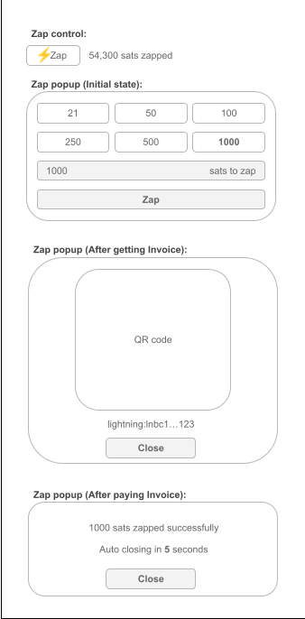

# Nostr Zap Component Specification

## Overview

- Component: `nostr-zap-button`
- Purpose: Send Lightning zaps to Nostr users
- Architecture: Extends `NostrUserComponent` → `NostrBaseComponent`

## Features

- Display zap button with Lightning icon and custom text
- Show total zap amount received (clickable to view individual zaps)
- Help icon (?) with dialog explaining zaps
- Modal for amount selection and payment
- Generate Lightning invoice via NIP-57
- QR code for mobile wallets
- WebLN integration for browser wallets
- Payment confirmation via zap receipt events (kind 9735)
- Support fixed or custom amounts
- URL-based zaps for specific content

## Zap Flow

1. User clicks zap button
2. Modal opens with amount presets (21, 100, 1000 sats)
3. User selects/customizes amount and adds optional comment
4. Generate Lightning invoice
5. Display QR code and wallet links
6. User completes payment
7. Listen for zap receipt events
8. Show "⚡ Thank you!" overlay
9. Close via × button or automatic after WebLN payment

## URL-Based Zaps

Kind **39735** is used as the custom addressable event kind for URL-based zap correlation.(`39735:pubkey:url`) so NIP-57 relay tag-copying gives us free relay-side `#a` filtering.

When `url` attribute is provided:
- Zap requests include an `["a", "39735:<recipient_pubkey>:<normalized_url>"]` tag
- The `a` tag value is computed deterministically from the component's `npub` and `url` attributes — no event pre-creation required
- Per NIP-57, relays copy the `a` tag from the zap request (kind 9734) to the zap receipt (kind 9735), enabling relay-side filtering with `#a`
- Total zap amount is fetched with `{"kinds": [9735], "#a": ["39735:pubkey:url"]}` — only URL-specific receipts are returned, no client-side parsing needed
- Enables content creators to track zaps per article/post

## Limitations

### Zap Count Scalability
⚠️ **1000-Event Cap**: The component queries up to 1000 zap receipt events (kind 9735) per user. For high-traffic creators, this may result in undercounting total zaps.

**Impact:**
- Total zap amount may not reflect all zaps received
- Zappers list may not show all contributors
- URL-specific totals may be incomplete

## API

### Required Attributes

At least one:
- `npub` - Bech32-encoded public key (npub1...)
- `nip05` - NIP-05 identifier (user@domain.com)
- `pubkey` - Hex-encoded public key (64 chars)

### Optional Attributes

- `text` (string, default: "Zap") - Button text (max 128 chars)
- `amount` (string) - Fixed zap amount in sats (1-210,000), hides amount selection
- `default-amount` (string, default: 21) - Default amount in modal (1-210,000)
- `url` (string) - URL for URL-based zaps; adds an `["a", "39735:<pubkey>:<url>"]` tag (see URL-Based Zaps section)
- `data-theme` (string, default: "light") - Allowed values: "light" or "dark"
- `relays` (string) - Comma-separated relay URLs

### CSS Variables

Icon:
- `--nostrc-icon-width` (default: 25px)
- `--nostrc-icon-height` (default: 25px)
- `--nostrc-help-icon-size` (default: 16px)

Button:
- `--nostrc-zap-btn-padding`
- `--nostrc-zap-btn-border-radius`
- `--nostrc-zap-btn-bg`
- `--nostrc-zap-btn-color`
- `--nostrc-zap-btn-hover-bg`
- `--nostrc-zap-btn-hover-color`
- `--nostrc-zap-btn-hover-border`

## Wireframes



### States

Default:
```text
┌─────────────┐
│ [⚡ Zap]     │ 1,234 ⚡ (?)
└─────────────┘
```

Loading:
```text
┌─────────────────┐
│ [⚡ skeleton...] │ [skeleton] (?)
└─────────────────┘
```

Error:
```text
┌─────────────────────────────────┐
│ ⚠️  Error message here          │
└─────────────────────────────────┘
```

Success:
```text
┌─────────────┐
│[✓ Zap Sent!]| 1,234 ⚡ (?)
└─────────────┘
```

### Modal Dialog Layout

```text
┌─────────────────────────────────────┐
│            Send a Zap           [×] │
├─────────────────────────────────────┤
│ [21 ⚡]      [100 ⚡]      [1000 ⚡]   │
│                                     │
│ ┌─────────────────────────────────┐ │
│ │ Custom sats: [________] [Update]│ │
│ └─────────────────────────────────┘ │
│ ┌─────────────────────────────────┐ │
│ │ Comment: [_____________] [Add]  │ │
│ └─────────────────────────────────┘ │
│                                     │
│ ┌─────────────────────────────────┐ │
│ │        QR Code image Here       │ │
│ └─────────────────────────────────┘ │
│                                     │
│                 [Copy]              │
│            [Open in Wallet]         │
└─────────────────────────────────────┘
```

### Help Dialog Layout

```text
┌─────────────────────────────────────┐
│           What is a Zap?        [×] │
├─────────────────────────────────────┤
│                                     │
│ A zap is a Lightning Network        │
│ payment sent to a Nostr user.       │
│                                     │
│ Zaps allow you to:                  │
│ • Send micropayments instantly      │
│ • Support content creators          │
│ • Show appreciation for posts       │
│                                     │
│ Learn more about zaps:              │
│ ┌─────────────────────────────────┐ │
│ │    [Watch YouTube Tutorial]     │ │
│ └─────────────────────────────────┘ │
└─────────────────────────────────────┘
```

### Zappers Dialog Layout

#### Initial State (with npubs in skeleton loaders)
```text
┌─────────────────────────────────────┐
│              Zappers            [×] │
├─────────────────────────────────────┤
│                                     │
│ ┌─────────────────────────────────┐ │
│ │ [skeleton] npub1abc123...       │ │
│ │     500 ⚡ • 2 hours ago         │ │
│ └─────────────────────────────────┘ │
│                                     │
│ ┌─────────────────────────────────┐ │
│ │ [skeleton] npub1def456...       │ │
│ │     1,000 ⚡ • 1 day ago         │ │
│ └─────────────────────────────────┘ │
│                                     │
│ ┌─────────────────────────────────┐ │
│ │ [skeleton] npub1ghi789...       │ │
│ │     250 ⚡ • 3 days ago          │ │
│ └─────────────────────────────────┘ │
│                                     │
└─────────────────────────────────────┘
```

#### Progressive Enhancement (as profiles load)
```text
┌─────────────────────────────────────┐
│              Zappers            [×] │
├─────────────────────────────────────┤
│                                     │
│ ┌─────────────────────────────────┐ │
│ │ [👤] Alice Smith                │ │
│ │     500 ⚡ • 2 hours ago         │ │
│ └─────────────────────────────────┘ │
│                                     │
│ ┌─────────────────────────────────┐ │
│ │ [skeleton] npub1def456...       │ │
│ │     1,000 ⚡ • 1 day ago         │ │
│ └─────────────────────────────────┘ │
│                                     │
│ ┌─────────────────────────────────┐ │
│ │ [👤] Charlie Brown              │ │
│ │     250 ⚡ • 3 days ago          │ │
│ └─────────────────────────────────┘ │
│                                     │
└─────────────────────────────────────┘
```

### Responsive

- Desktop: 424px width
- Mobile: max-width 90vw
- Button: min-height 47px

## Usage

Basic:
```html
<nostr-zap-button npub="npub1..."></nostr-zap-button>
```

Custom text:
```html
<nostr-zap-button npub="npub1..." text="Send Sats!"></nostr-zap-button>
```

Fixed amount:
```html
<nostr-zap-button npub="npub1..." amount="5000"></nostr-zap-button>
```

URL-based:
```html
<nostr-zap-button npub="npub1..." url="https://saiy2k.in/2025/02/17/nostr-components/"></nostr-zap-button>
```

Custom styling:
```html
<nostr-zap-button npub="npub1..." style="
  --nostrc-icon-width: 30px;
  --nostrc-zap-btn-bg: #ff6b35;
"></nostr-zap-button>
```

Dark theme:
```html
<nostr-zap-button npub="npub1..." data-theme="dark"></nostr-zap-button>
```

## Zappers Dialog

Shows individual zap details with progressive loading:
- Triggered by clicking total zap amount
- Opens instantly with skeleton loaders showing npubs
- Profile metadata loads in background
- Each entry updates independently as data loads

Each zap shows:
- Amount (sats with ⚡)
- Date (relative time)
- Author name (from profile metadata, fallback to npub)
- Profile picture (from metadata, fallback to default)
- Clickable link to njump.me profile

Data:
- Fetches kind 9735 events
- Respects URL filtering for URL-based zaps
- Sorted chronologically (newest first)

TODO:
- Handle dynamic change of attributes.
- Refresh totals after successful zap.
