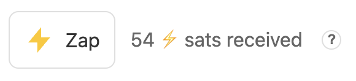
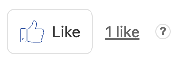

import { Meta } from '@storybook/addon-docs/blocks';

<Meta title="Nostr Components" />

# Nostr Components!

**Embed Nostr anywhere on the internet, a Zap Button for every webpage.**

<a href="https://github.com/saiy2k/nostr-components">
  <b> View Github repository </b> &gt;
</a>

<nostr-like></nostr-like>

<br/>

<nostr-zap url="https://nostr-components.web.app/" nip05="saiy2k@iris.to"></nostr-zap>

Nostr Components makes it easy to embed Nostr profiles, posts, and follow buttons in any website. Inspired by <a href="https://unpkg.com/nostr-web-components@latest/demo.html">fiatjaf's Nostr Web Components</a>, this project adds a beautiful UI, a Storybook component generator (for webmasters), and allows embedding Nostr content anywhere on the Internet.

 * **[Zap button](#1-nostr-zap)**
 * **[Follow button](#2-nostr-follow)**
 * **[Like button](#3-nostr-like)**
 * **[Profile Badge](#4-nostr-profile-badge)**
 * **[Profile](#5-nostr-profile)** 
 * **[Post](#6-nostr-post)**
 * **[WordPress Integration](#7-wordpress-integration)**

## Usage

### Quick Start

#### Option 1: CDN (Recommended for Quick Integration)

Add the component script to your HTML's `<head>`. Each component can be loaded individually or use the full bundle.

```html
<head>
  <!-- Load individual component (recommended for smaller bundles) -->
  <script type="module" src="https://cdn.jsdelivr.net/npm/nostr-components@latest/dist/components/nostr-profile.es.js"></script>
  
  <!-- Or load the full bundle: ES -->
  <script type="module" src="https://cdn.jsdelivr.net/npm/nostr-components@latest/dist/nostr-components.es.js"></script>

  <!-- Or load the full bundle: UMD -->
  <script src="https://cdn.jsdelivr.net/npm/nostr-components@latest/dist/nostr-components.umd.js"></script>

  <!-- Optional: Dark theme -->
  <link rel="stylesheet" href="https://cdn.jsdelivr.net/npm/nostr-components@latest/dist/themes/dark.css">
</head>
<body>
  <h1> Welcome to My home page </h1>
  <nostr-zap nip05="saiy2k@iris.to" url="https://nostr-components.web.app/"></nostr-zap>
  <nostr-profile npub="npub1qsvv5ttv6mrlh38q8ydmw3gzwq360mdu8re2vr7rk68sqmhmsh4svhsft3"></nostr-profile>
  <nostr-like></nostr-like>

  <!-- For more components, see blow -->
</body>
```

#### Option 2: NPM Package

Install the package via npm:

```bash
npm install nostr-components
```

Then import components in your JavaScript/TypeScript:

```javascript
// Import individual components
// [Will update here soon]

// Or import the full bundle
import 'nostr-components';
```

### Authentication

All interactive components (Follow, Like, Zap) require user authentication. Components use [NostrLogin](https://github.com/nostrband/nostr-login) which supports:
- **NIP-07 Browser Extensions** (Alby, nos2x, etc.)
- **NIP-46 Remote Signers** (Bunkers)

The authentication flow is handled automatically when users interact with components.

---

## 1. Nostr Zap

A Zap button that allows users to send sats to any Nostr user or a URL associated with a User.
What is [Zap](https://www.youtube.com/shorts/PDnrh8pkF3g)? 

**Usage:**

```html
<head>
  <script 
    type="module" 
    src="https://cdn.jsdelivr.net/npm/nostr-components@latest/dist/components/nostr-zap.es.js">
  </script>
</head>
<body>
  <nostr-zap 
    npub="npub1qsvv5ttv6mrlh38q8ydmw3gzwq360mdu8re2vr7rk68sqmhmsh4svhsft3"
    theme="dark"
    url="https://nostr-components.web.app/"
    text="⚡ Zap Me"
  ></nostr-zap>
</body>
```

**Preview:**



---

## 2. Nostr Follow

A simple button that allows users to follow a Nostr profile.

**Usage:**

```html
<head>
  <script
    type="module"
    src="https://cdn.jsdelivr.net/npm/nostr-components@latest/dist/components/nostr-follow-button.es.js"
  ></script>
</head>
<body>
  <nostr-follow-button
    npub="npub1qsvv5ttv6mrlh38q8ydmw3gzwq360mdu8re2vr7rk68sqmhmsh4svhsft3"
  ></nostr-follow-button>
</body>
```

**Preview:**


---

## 3. Nostr Like

A like button that uses NIP-25 (External Content Reactions) to like any URL on the web.
When URL is not specified, current URL is taken.

**Usage:**

```html
<head>
  <script 
    type="module" 
    src="https://cdn.jsdelivr.net/npm/nostr-components@latest/dist/components/nostr-like.es.js">
  </script>
</head>
<body>
  <!-- Like the current page URL -->
  <nostr-like></nostr-like>

  <!-- Like a specific URL with custom text -->
  <nostr-like 
    url="https://github.com/saiy2k/nostr-components" 
    text="❤️">
  </nostr-like>
</body>
```

**Preview:**



---

## 4. Nostr Profile Badge

A small badge displaying a Nostr profile with a username and avatar.

**Usage:**

```html
<head>
  <script
    type="module"
    src="https://cdn.jsdelivr.net/npm/nostr-components@latest/dist/components/nostr-profile-badge.es.js"
  ></script>
</head>
<body>
  <nostr-profile-badge
    pubkey="npub180cvv07tjdrrgpa0j7j7tmnyl2yr6yr7l8j4s3evf6u64th6gkwsyjh6w6"
  ></nostr-profile-badge>
</body>
```

**Preview:**


---

## 5. Nostr Profile

A detailed profile card showing avatar, name, bio, notes count, followers, etc.

**Usage:**

```html
<head>
  <script 
    type="module" 
    src="https://cdn.jsdelivr.net/npm/nostr-components@latest/dist/components/nostr-profile.es.js">
  </script>
</head>
<body>
  <nostr-profile
    pubkey="npub1a2cww4kn9wqte4ry70vyfwqyqvpswksna27rtxd8vty6c74era8sdcw83a"
  ></nostr-profile>
</body>
```

**Preview:**


---

## 6. Nostr Post

Embed any Nostr post by providing the event ID.

**Usage:**

```html
<head>
  <script 
    type="module" 
    src="https://cdn.jsdelivr.net/npm/nostr-components@latest/dist/components/nostr-post.es.js">
  </script>
</head>
<body>
  <nostr-post
    eventId="note1t2jvt5vpusrwrxkfu8x8r7q65zzvm32xuur6y7am4zn475r8ucjqmwwhd2"
  ></nostr-post>
</body>
```

**Preview:**


---

## 7. WordPress Integration

The Nostr Components WordPress plugin provides Gutenberg blocks and shortcodes for all components, making it easy to embed Nostr functionality in your WordPress site.

For more details, see the [WordPress Plugin](https://wordpress.org/plugins/saiy2k-nostr-components/).